# Service Infrastructure Architecture

This diagram represents the AWS resources defined in `main.tf`.

## Architecture Diagram

```mermaid
flowchart TB
    subgraph External["External"]
        Client["Client / Internet"]
    end

    subgraph Network["VPC"]
        subgraph LoadBalancing["Load balancing"]
            ALB["ALB<br/><i>alb_module</i>"]
            ExtTG["External Target Group"]
            IntTG["Internal Target Group<br/><i>optional, non-dev</i>"]
        end

        subgraph Compute["Compute"]
            ECS["ECS Service<br/><i>ecs_module</i><br/>Fargate tasks"]
        end

        subgraph Lambdas["Lambda"]
            LambdaStream["DynamoDB Stream Processor<br/><i>lambda_stream_processor</i>"]
            LambdaSQS["SQS Processor<br/><i>lambda_sqs_processor</i>"]
        end
    end

    subgraph Data["Data & messaging"]
        DynamoDB[("DynamoDB Global Table<br/><i>dynamodb_module</i><br/>Streams enabled")]
        SNS["SNS Topic<br/><i>sns_module</i>"]
        SQS["SQS Queue<br/><i>sqs_module</i>"]
        SQS_DLQ["SQS DLQ<br/><i>sqs_module</i>"]
        Stream_DLQ["Stream Lambda DLQ<br/><i>lambda_stream_processor</i>"]
    end

    subgraph Security["Security & config"]
        Secrets["Secrets Manager<br/><i>secrets_module</i>"]
        KMS["KMS Decrypt Policy<br/><i>iam</i>"]
    end

    Client -->|HTTPS| ALB
    ALB --> ExtTG
    ExtTG --> ECS
    IntTG -.->|optional| ECS

    ECS -->|read/write| DynamoDB
    ECS -->|secrets| Secrets
    ECS --> KMS

    DynamoDB -->|stream| LambdaStream
    LambdaStream -->|publish| SNS
    LambdaStream -.->|on failure| Stream_DLQ
    SNS -->|subscribe| SQS
    SQS -->|trigger| LambdaSQS
    SQS -.->|redrive after max receives| SQS_DLQ
```

## Component Summary

| Component | Terraform module / resource | Purpose |
|-----------|-----------------------------|---------|
| **ALB** | `alb_module` | External Application Load Balancer; WAF, listener, external target group |
| **Internal Target Group** | `internal_target_group` | Internal listener target group (disabled in development) |
| **ECS Service** | `ecs_module` | Fargate service; tasks register with ALB external TG (and optionally internal TG) |
| **Secrets Manager** | `secrets_module` | Service-specific secrets |
| **KMS policy** | `aws_iam_policy.kms_decrypt_policy` | IAM policy for ECS task execution (KMS decrypt) |
| **DynamoDB** | `dynamodb_module` | Global table with streams (hash key `id`) |
| **SNS** | `sns_module` | SNS topic for event fan-out |
| **SQS** | `sqs_module` | Main queue subscribed to SNS (`sns_to_sqs` + queue policy) |
| **SQS DLQ** | `sqs_module` | Dead-letter queue for main SQS; messages redrive after max receive count |
| **Lambda (stream)** | `lambda_stream_processor` | Triggered by DynamoDB stream; publishes to SNS; failed records → Stream Lambda DLQ |
| **Stream Lambda DLQ** | `lambda_stream_processor` | DLQ for failed DynamoDB stream records (Lambda destination on failure) |
| **Lambda (SQS)** | `lambda_sqs_processor` | Triggered by SQS; processes messages from SNS → SQS |

## Data flow

1. **Request path:** Client → ALB → External Target Group → ECS tasks. Optional internal path via Internal Target Group.
2. **App data:** ECS reads/writes DynamoDB; ECS uses Secrets Manager and KMS (decrypt) for config/secrets.
3. **Event pipeline:** DynamoDB stream → Stream Lambda → SNS → SQS → SQS Lambda (async processing). Failed stream records go to Stream Lambda DLQ; SQS messages that exceed max receives go to SQS DLQ.

## Mermaid preview

To view the diagram:

- Paste the Mermaid block into [mermaid.live](https://mermaid.live), or
- Open this file in GitHub / a Markdown viewer that supports Mermaid.
